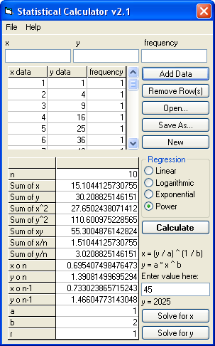



## Statistical Calculator v2\.1

### Description

Shows the mean, median, mode, variance, sum, standard deviation, average deviation, coefficient of deviation, total, square total, and variance for an array of values using the sample method. Computes any of four different types of regression models (Linear, Logarithmic, Exponential, or Power). Includes an equation solver for both x and y data. Here's whats been changed in v2.1:

1. When "Remove row" is clicked, it now removes all selected rows rather than just one row at a time.

2. Double-clicking on a row in the "x, y, frequency" data-grid now allows the user to edit data already entered without having to remove the row and re-enter the data.

3. A bug was removed where the calculator didn't set the "DataSaved" Boolean bit when the user clicked on the "Remove Row" button.
 
### More Info
 

             |
---                |---
**Submitted On**   |2003-09-12 09:30:40
**By**             |[Joshua Robertson](https://github.com/Planet-Source-Code/PSCIndex/blob/master/ByAuthor/joshua-robertson.md)
**Level**          |Advanced
**User Rating**    |5.0 (40 globes from 8 users)
**Compatibility**  |VB 6\.0
**Category**       |[Math/ Dates](https://github.com/Planet-Source-Code/PSCIndex/blob/master/ByCategory/math-dates__1-37.md)
**World**          |[Visual Basic](https://github.com/Planet-Source-Code/PSCIndex/blob/master/ByWorld/visual-basic.md)
**Archive File**   |[Statistica1644709122003\.zip](https://github.com/Planet-Source-Code/joshua-robertson-statistical-calculator-v2-1__1-48446/archive/master.zip)

